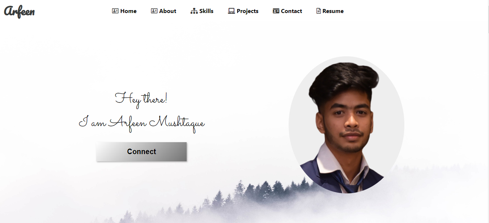
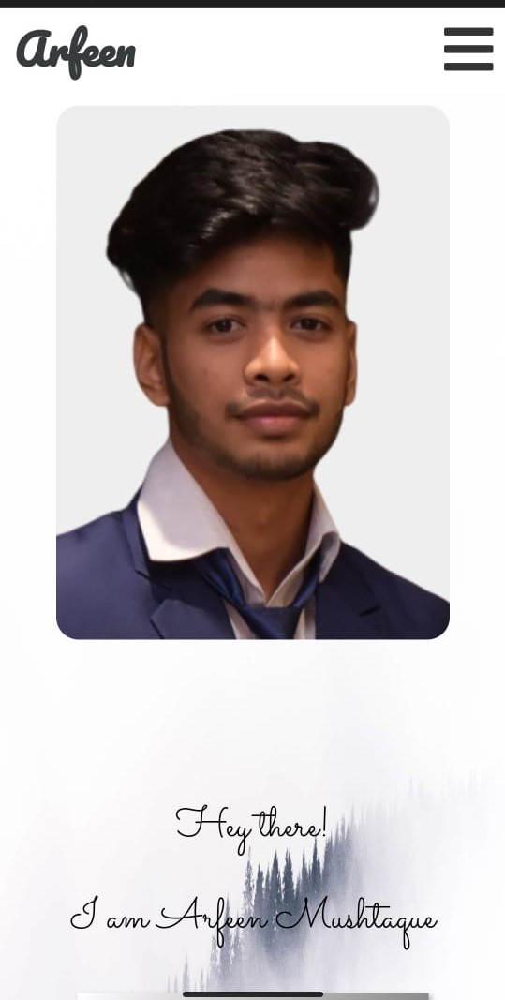
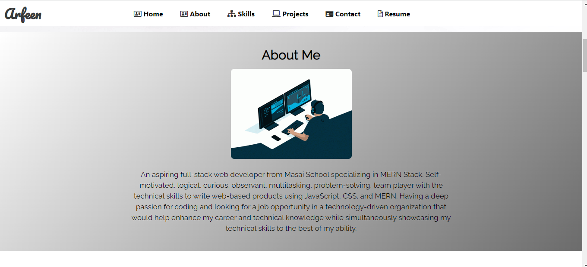
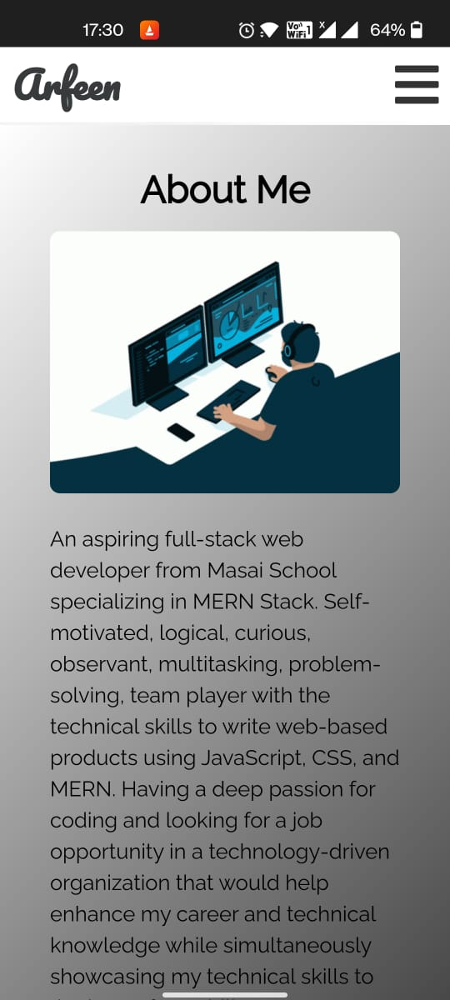
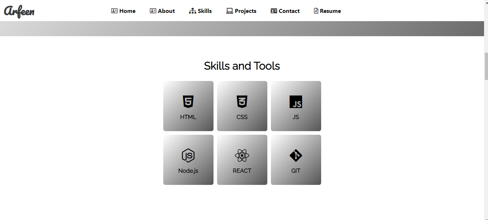
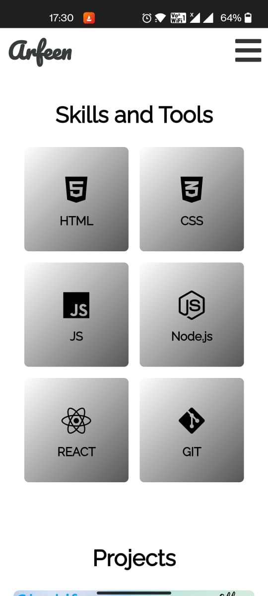
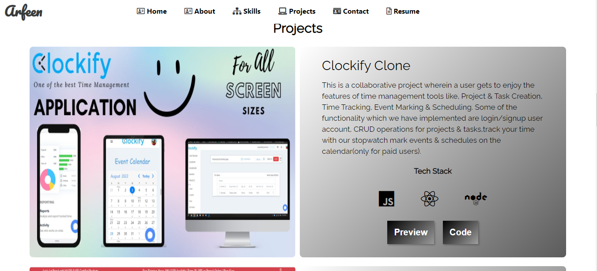
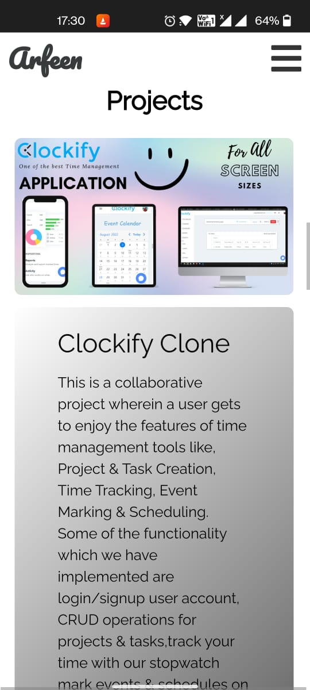

<h2> Hi there! I'm Arfeen, I'm an aspiring MERN Full-Stack Web Developer  </h2>
<h3>This is my Portfolio made in React for all screen sizes. You can visit my portfolio website:</h3>

</>
  
<h2 align="left">About:</h2>

An aspiring full-stack web developer with a specialization in MERN stack. Seeking to enhance and utilize my knowledge and skills for the best of the organization.

You can see my Resume
  <a href="https://drive.google.com/file/d/1yFgncrdNGBEKe5Augv2cNhwr61I0i3Z1/view?usp=sharing" target="blank">here</a>.

## Glimpses of my Portfolio 🙈 :

<table>
   <tr>
     <td>For Large Screens</td>
     <td>For Cell Phone</td>
   </tr>
  <tr>
    <td></td>
    <td></td>
  </tr>
  <tr>
    <td></td>
    <td></td>
  </tr>
  <tr>
    <td></td>
    <td></td>
  </tr>
  <tr>
    <td></td>
    <td></td>
  </tr>
 
</table>

 

<h2 align="left">Skills & Frameworks:</h2>
<h3>Front-End:</h3>

  
    
    
    
    
    
    
    
    
  

<h3>Back-End:</h3>

    
    
    
    
    
  

<h3>Testing:</h3>

    
    
  

<h3>Other:</h3>
  

    
    
  

 
  
  

  <samp>
    <h2 align="left">You Can Reach Me By:</h2>
    

       
      
      
    

  </samp>

